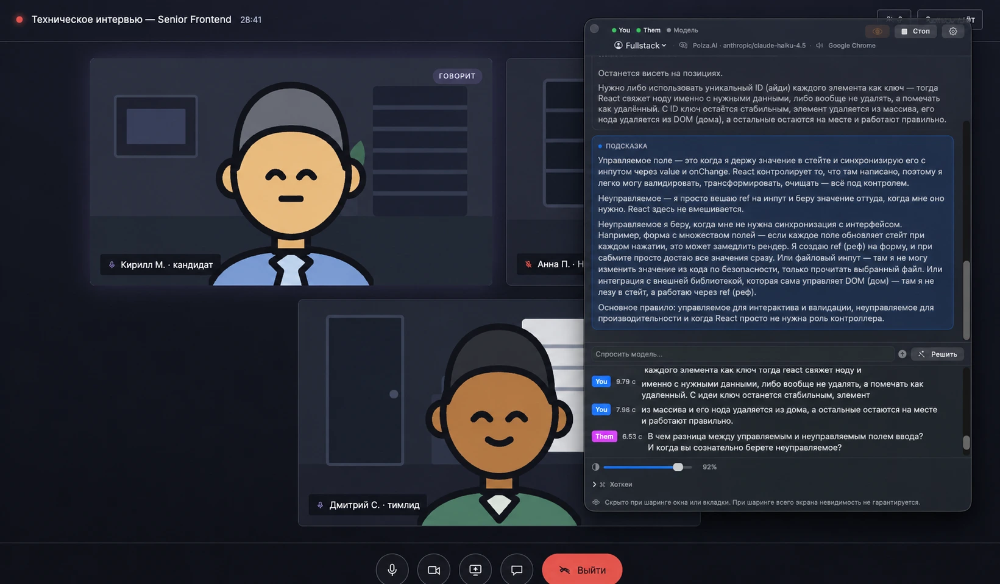

# GhostMeet

[](https://github.com/slimgo/ghostmeet/actions/workflows/ci.yml)
[](https://github.com/slimgo/ghostmeet/releases)
[](https://github.com/slimgo/ghostmeet)

Оверлей поверх всех окон, который помогает во время видеозвонка. Слушает **два канала звука**,
распознаёт речь **на самой машине** и отвечает через ту модель, которую вы выбрали, — оставаясь
невидимым для шаринга экрана.

English version — [README.md](README.md).



> ### Прочтите это до того, как включать
>
> **GhostMeet прячет своё окно от захвата экрана, но это попытка, а не гарантия.**
>
> Защита действует там, где картинку отдаёт сам macOS: шаринг **окна или вкладки**. Шаринг всего
> экрана выведен за границы продукта решением, а не по недосмотру
> ([ADR-0004](docs/adr/0004-invisibility-scope.md)). Вживую окно не появилось и там — но это один
> прогон, в одном сервисе, на одной версии системы, и закладываться на него нельзя. Звонилки
> захватывают экран по-разному, а поведение `sharingType` между версиями macOS уже менялось:
> обновление системы способно ослабить защиту, не сообщив об этом никому.
>
> Вне этой защиты остаётся всё, что идёт мимо системного захвата: камера телефона, направленная на
> экран, человек за плечом, второй монитор. И сам процесс — приложение не прячется от того, кто
> перечисляет запущенные программы, так что прокторингу оно видно.
>
> **Приложение слышит обе стороны разговора и распознаёт их речь.** Во многих юрисдикциях запись
> собеседника требует его согласия, а скрытый помощник на экзамене, собеседовании или встрече под
> запись нарушает правила площадки. GhostMeet сделан для законного: своих заметок, разбора после
> звонка, тренировки, доступности. Как вы им пользуетесь — ваше решение и ваша ответственность.

> **Состояние: 0.5.2.** MVP закрыт и пройден вживую на настоящем звонке. Это личный BYOK-инструмент,
> а не продукт: своего сервера нет, аккаунта нет, нотаризованной сборки нет.

---

## Что он делает

- **Два канала, которые не смешиваются.** `You` — ваш микрофон, `Them` — звук приложения, в
  котором идёт звонок. Принадлежность к каналу определяется **источником**, а не смыслом: всё, что
  пришло с микрофона, — это `You`, даже если вы зачитываете чужой вопрос вслух.
- **Интерфейс на русском и английском.** Берётся системный язык, меняется в настройках,
  применяется с следующего запуска. Это язык **окна**, и он не тот же, что язык подсказки:
  подсказка следует языку разговора, потому что её читают вслух собеседнику, — английское
  собеседование получает английский ответ при любом языке окна.
- **Локальное распознавание.** WhisperKit на Neural Engine, отдельный проход на канал, нарезка на
  реплики по паузам. Звук никуда не уходит.
- **Подсказка приходит только когда её просят.** Захват, нарезка и распознавание идут непрерывно и
  наполняют транскрипт; в модель не уходит ничего, пока вы не нажали аккорд
  ([ADR-0008](docs/adr/0008-hotkey-triggered-suggestions.md)).
- **Экран едет с каждым запросом.** Скриншот и OCR через Vision, снятые в момент нажатия, — именно
  на этом держится режим «Реши задачу».
- **Невидимость для шаринга.** Окно исключено из захвата через `sharingType = .none` — в том числе
  из наших собственных скриншотов, поэтому модель не видит свой предыдущий ответ. Переключатель в
  шапке это отключает — иначе снять скриншот или ролик самого приложения невозможно. Включён при
  каждом запуске, на диск не пишется, на время прослушивания блокируется
  ([ADR-0011](docs/adr/0011-visibility-switch-in-the-window.md)).
- **Любой провайдер.** Anthropic, OpenAI-совместимые эндпоинты, Gemini, локальные серверы (Ollama,
  LM Studio, llama.cpp, MLX-LM) и CLI-инструменты — за одним протоколом, ключи в Keychain.

Целевой сценарий один: **техническое собеседование, где пользователь — кандидат.** Это самый
жёсткий набор требований: задержка критична, «Реши задачу» — основной режим, а не бонус. Остальные
сценарии получаются ослаблением этого.

## Как устроено

```
 микрофон ────────► буфер You ─┐
                               ├─► нарезка на реплики ─► WhisperKit ─► транскрипт
 SCK / Process Tap ► буфер Them┘     (пауза, RMS-гейт, страховочный флаш)
                                                                    │
                            нажатие ⌥⌘A / ⌥⌘Z / ⌥⌘X ────────────────┤
                                                                    ▼
                                        скриншот + OCR ─► промпт ─► LLM ─► карточка
```

Нажатие сначала **дозакрывает открытую реплику `Them`**: жмут ровно тогда, когда собеседник
договорил, — то есть до того, как набежит порог паузы, — и без дозакрытия последней фразы вопроса
в промпте бы не было. Распознавание при этом не отменяется никогда: слова принадлежат разговору, а
не ответу.

## Требования

- macOS **14.4 или новее** — этого требует Core Audio Process Tap.
- Желательно Apple silicon: распознавание идёт на Neural Engine.
- Ключ облачного провайдера либо локальный сервер моделей.

Разрешений запрашивается четыре, каждое под одно дело: **микрофон** (`You`), **захват звука**
(`Them`), **запись экрана** (скриншоты и «Реши задачу»), **распознавание речи** (запасной путь
через Apple Speech).

## Установка

Скачайте DMG из [Releases](https://github.com/slimgo/ghostmeet/releases), перетащите приложение в
«Программы» и снимите карантин:

```bash
xattr -dr com.apple.quarantine /Applications/GhostMeet.app
```

**Сборка подписана, но не нотаризована, и эта команда — не формальность.** У проекта сертификат
Apple Development, а не Developer ID, поэтому Gatekeeper отказывается открывать приложение, пока
флаг не снят. Подпись при этом настоящая и стабильная, и это важнее, чем
кажется: разрешения macOS привязаны к подписи, а при ad-hoc-подписи каждая новая сборка спрашивала
бы микрофон и запись экрана заново.

**Команда нужна один раз, на эту установку.** С 0.4.0 приложение обновляет себя само: предлагает
новую версию строкой в своём окне и ставит её без терминала и без перетаскивания. Карантин ставит
тот, кто скачивает файл, — браузер ставит, приложение нет, — поэтому обновление, установленное
приложением, его не получает ([ADR-0012](docs/adr/0012-sparkle-installs-the-update.md)). Саму 0.4.0
при этом придётся поставить руками: у предыдущей версии нечем себя обновить, так что первым
автоматическим станет обновление **после** неё.

Приложение работает в accessory-режиме — **без иконки в Dock и без строки в ⌘-Tab.** Запускать из
Spotlight или из папки «Программы»; в Launchpad его нет.

## Сборка из исходников

**Нужен Xcode 26 или новее.** Проект собирается с `SWIFT_DEFAULT_ACTOR_ISOLATION = MainActor` —
это настройка Swift 6.2; на Xcode 16.x он не собирается вовсе.

Проект Xcode лежит уровнем ниже, в `GhostMeet/GhostMeet.xcodeproj`:

```bash
xcodebuild -project GhostMeet/GhostMeet.xcodeproj -scheme GhostMeet -configuration Debug build
```

Прогон тестов (Swift Testing, таргет `GhostMeetTests`):

```bash
xcodebuild -project GhostMeet/GhostMeet.xcodeproj -scheme GhostMeet -destination 'platform=macOS' test
```

Сборка подписанного DMG:

```bash
./scripts/make-dmg.sh
```

Две ловушки, о которых стоит знать до того, как трогать файл проекта:

- `GhostMeet/GhostMeet/` — **файловая синхронизированная группа**: новый `.swift` попадает в таргет
  просто оттого, что он появился на диске. Зато любой *не-исходник*, положенный туда, копируется в
  бандл лишним ресурсом — поэтому `Info.plist` лежит рядом с проектом, а не внутри.
- Строки разрешений живут только в этом настоящем `Info.plist`. `INFOPLIST_KEY_*` работает лишь для
  ключей, известных Xcode, а неизвестные — вроде `NSAudioCaptureUsageDescription` — выбрасываются
  **без единого предупреждения**: сборка проходит, приложение доезжает без доступа к экрану.

## Приватность

- Распознавание речи локальное. Звук не покидает машину.
- Ключи API лежат в Keychain — не в репозитории и не в файлах настроек.
- На диск не пишется ничего, пока вы это не включите.
- Резюме, из которого заполняется профиль, читается один раз и нигде не сохраняется — ни на диск,
  ни в `UserDefaults`, ни в лог. Перед нажатием кнопки на экране написано, какому провайдеру уйдёт
  текст и покинет ли он машину.
- Логируется только жизненный цикл. Покадрового лога нет нигде и сознательно: в этом приложении
  такой лог означал бы запись разговора на диск.
- **Сохранение диалога — единственное, что пишет на диск, и начинаете его только вы.** Кнопка под
  транскриптом собирает файл в Markdown — обе стороны разговора и ответы модели, у каждого из
  которых назван вид подсказки, — и отдаёт его
  панели сохранения, так что файл появляется там, куда вы указали, а не в нашей папке. Это весь
  разговор открытым текстом; обращайтесь с ним соответственно.
- **Один запрос делаете не вы — лента обновлений.** При запуске приложение спрашивает
  `appcast.xml`, лежащий рядом с последним релизом, и показывает одну строку, если есть версия
  новее. Уходит IP-адрес и версия приложения, больше ничего; ответ — файл, который может открыть
  кто угодно. Необязательная отправка сведений о системе, которую умеет Sparkle, выключена — и в
  Info.plist, и в коде, — а собранный бандл проверяется на это при каждом выпуске. Включено по
  умолчанию, потому что иначе узнать о новой сборке неоткуда; выключается одним переключателем, и
  выключенный не делает запроса вовсе. Нажатие «обновить» скачивает образ, проверяет его подпись
  EdDSA и заменяет приложение — во время звонка не делает этого никогда. Подробнее —
  [ADR-0010](docs/adr/0010-update-check-at-launch.md) и
  [ADR-0012](docs/adr/0012-sparkle-installs-the-update.md).

## Границы

- **Шаринг всего экрана не поддерживается** — это решение, а не недоделка, см.
  [ADR-0004](docs/adr/0004-invisibility-scope.md). Шарить нужно окно или вкладку; чего защита не
  покрывает вовсе — во врезке в начале.
- Оба бэкенда канала `Them` работают на уровне **приложения**. Отделить вкладку со звонком от
  остальных вкладок браузера не может ни один из них.
- Нотаризации нет и не будет без платного Developer ID.
- `SpeechAnalyzer` (macOS 26) быстрее, но русской локали у него нет, поэтому он применим только к
  англоязычным звонкам и пока не построен.

## Где лежат решения

Этот репозиторий — в той же мере запись решений, в какой и код. Прочитать до того, как открывать
заново закрытый вопрос:

| | |
|---|---|
| [docs/GhostMeet.md](docs/GhostMeet.md) | спека продукта: возможности, стек, структура файлов, планы |
| [docs/GhostMeet-Prompts.md](docs/GhostMeet-Prompts.md) | авторитетные тексты промптов, дословно сверяемые тестом |
| [CONTEXT.md](CONTEXT.md) | глоссарий: у `You`, `Them`, «реплики», «подсказки», «профиля» точные определения |
| [docs/adr/](docs/adr/) | одиннадцать архитектурных решений; заменённые остаются ради рассуждения, которое в них записано |
| [CHANGELOG.md](CHANGELOG.md) | что и когда появилось — и почему |

Правил два: документы правятся тем же изменением, что и код, и **ADR никогда не переписывается** —
чтобы изменить решение, пишут следующее и ссылаются на прежнее. Оба записаны в
[CLAUDE.md](CLAUDE.md).

## Релизы

Релиз собирается локально, потому что подписной сертификат живёт на одной машине:

```bash
./scripts/release.sh 0.2.0
```

Скрипт откажется работать на грязном дереве, проверит, что версия совпадает с проектом и описана в
CHANGELOG, прогонит тесты, соберёт и подпишет DMG, поставит тег и зальёт релиз. CI на GitHub
собирает и прогоняет тесты на каждый push, но ничего не подписывает. Подробнее —
[docs/releasing.md](docs/releasing.md).

## Лицензия

[MIT](LICENSE). Паки собеседований и стенды в `.scratch/` — часть репозитория и лежат под той же
лицензией; у моделей, к которым вы подключаете приложение, свои условия, а ключи API ваши.
